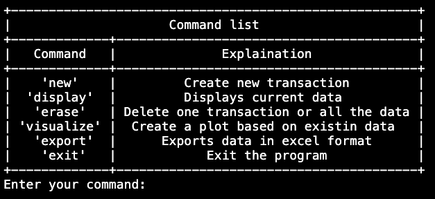
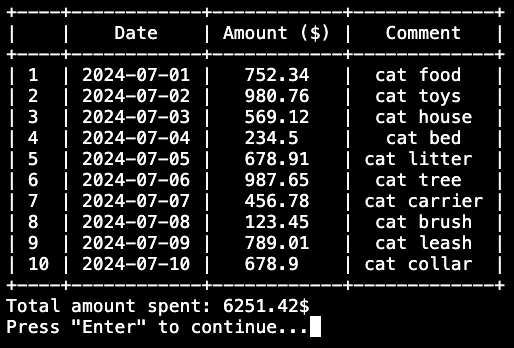
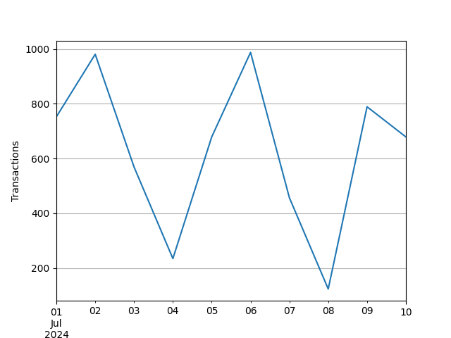
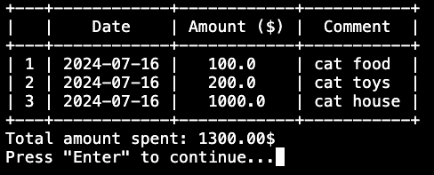
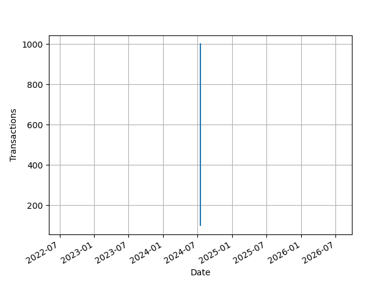

# FINANCE TRACKER
## My personal information

    Name: Nohin Pavlo
    edX: pavlonohin
    GitHub: noginpavlo
    Country: Ukraine, Kyiv
    Email: nogin.pavlo@lll.kpi.ua

## Project preview
Video Demo:
[Link](https://www.youtube.com/watch?v=a5EptZK5xKw)

## Project description

**Finance Tracker** is designed to record a user's financial transactions over an extended period, providing better control over their finances. The application allows users to:

* Record each transaction they make.
* Store financial data securely.
* Export data in Excel format.
* Visualize expenditure dynamics through plotted graphs.

*Data Structure*: Each transaction is recorded in a date-amount-comment format. The date is captured automatically by the program, while the transaction amount and comment are provided by the user.

With **Finance Tracker**, users can review their financial data, visualize it in plot format, and export it as an Excel file for detailed financial analysis. This comprehensive tool ensures that users have a clear and organized view of their financial activities, aiding in effective financial management.

## Table of Contents
- [FINANCE TRACKER](#finance-tracker)
  - [My personal information](#my-personal-information)
  - [Project preview](#project-preview)
  - [Project description](#project-description)
  - [Table of Contents](#table-of-contents)
  - [Program features:](#program-features)
    - [Presenting a user with program's functional](#presenting-a-user-with-programs-functional)
    - [Capturing transaction data](#capturing-transaction-data)
    - [Displaying data](#displaying-data)
    - [Deleting data](#deleting-data)
    - [Visualizing data](#visualizing-data)
    - [Exporting data to Excel format](#exporting-data-to-excel-format)
  - [Directory Structure](#directory-structure)
  - [How to test](#how-to-test)

## Program features:

### Presenting a user with program's functional

Presenting users with a list of commands is implemented by executing the `command_list()` function. This function utilizes the `PrettyTable` library to create a table containing the names of functions along with comprehensive explanations of their functionalities.

*Example output of `command_list()`:*



*Implementation of `command_list()` function:*

```python
from prettytable import PrettyTable

def command_list():
    pr_table = PrettyTable()
    pr_table.title = "Command list"
    pr_table.field_names = ["Command", "Explaination"]
    pr_table.add_row(["'new'", "Create new transaction"])
    pr_table.add_row(["'display'", "Displays current data"])
    pr_table.add_row(["'erase'", "Delete one transaction or all the data"])
    pr_table.add_row(["'visualize'", "Create a plot based on existin data"])
    pr_table.add_row(["'export'", "Exports data in excel format"])
    pr_table.add_row(["'exit'", "Exit the program"])
    return pr_table
```

[Back to Table of Contents](#table-of-contents)

### Capturing transaction data

Recording transaction data is facilitated through the `new()` function. `new()` captures current transaction details using `date.today()` from the `datetime` module for the transaction date, records the transaction amount in dollars ($), and includes the user's comments. It validates that the entered amount is a decimal number and allows the user to use the `back` command to return to the main menu. `new()` stores this data temporarily in a global variable `new_row`. The function accepts `prompt` and `new_row` arguments: `prompt` is a string used to prompt the user to record the transaction, while `new_row` is the temporary storage variable.

*Implementation of `new()` function:*

```python
from datetime import date

def new(prompt, new_row):
    while True:
        transaction_input = input(prompt)
        if transaction_input.lower() == "back":
            return
        try:
            transaction_input = float(transaction_input)
            new_row += f"{date.today()},"
            new_row += f"{transaction_input},"
            print("Transaction added.")

            comment_input = input("Add your comment: ")
            new_row += f"{comment_input}\n"
            format_data(new_row)
            input('Comment recorded. Press "Enter" to continue...')
            return new('Enter new transaction amount (Type "back" to exit): ', new_row)

        except ValueError:
            print("Transaction is not a decimal number.")
```

[Back to Table of Contents](#table-of-contents)

### Displaying data

The program displays data retrieved from a CSV database in a table format. The displayed data includes the transaction date, amount in dollars ($), user's comment, and the total sum of expenses. This functionality is implemented by the `display()` function.

*Example output:*



* The `display()` function presents recorded data to the user in a tabular format using `tabulate`. It accepts a CSV database file as an argument and returns a `pandas.DataFrame` object. This DataFrame is utilized to generate a table using `tabulate`.
Before displaying the data, `display()` clears the terminal by calling the `clear_terminal()` function.
* The `display()` function also performs total amount sum calculation using the `calculate_sum()` function.

*Implementation of `display()` function:*

```python
import pandas

def display(csv):
    clear_terminal()
    display_data_frame = pandas.read_csv(csv)
    display_data_frame.reset_index(drop=True, inplace=True)
    display_data_frame.index = display_data_frame.index + 1
    print(tabulate.tabulate(display_data_frame, headers="keys", tablefmt="pretty"))
    print(calculate_sum(display_data_frame))
    return display_data_frame
```

* The `calculate_sum()` function accepts a `pandas.DataFrame` object as an argument and returns an f-string displaying the total amount of money the user has spent.

*Implementation of `calculate_sum()` function:*

```python
def calculate_sum(df):
    total_amount = df["Amount ($)"].sum()
    return f"Total amount spent: {total_amount:.2f}$"
```

* The `clear_terminal()` clears terminal for better UI.

*Implementation of `clear_terminal()` function:*

```python
def clear_terminal():
    os.system("clear")
```

[Back to Table of Contents](#table-of-contents)

### Deleting data

The program provides two methods to delete data: deleting all existing data and deleting individual transactions.
Data deletion is managed through the `erase()`, `erase_all()`, and `erase_transaction()` functions.


* The `erase()` function prompts the user to specify whether they wish to delete all entries or a single record. Inputting either the `all` or `one` command triggers the corresponding deletion function (`erase_all()` or `erase_transaction()`). Additionally, `erase()` ensures that the user's response conforms strictly to the `all` or `one` format, otherwise the function recurses. The `erase()` function accepts a single string argument to prompt the user with instructions.

*Implementation of `erase()` function:*

```python
def erase(prompt):
    user_answer = input(prompt)
    user_answer = user_answer.strip(" ")
    if user_answer.lower() == "all":
        erase_all()
    elif user_answer.lower() == "one":
        erase_transaction()
    else:
        input('The answer must be "all" or "one". Press "Enter to continue..."')
        return erase(prompt)
```

* The `erase_all()` function opens the database CSV file in append mode and rewrites the file using a context manager. The reformatted file contains only column names and no previously recorded data. Before proceeding with the deletion of all data, `erase_all()` prompts the user to confirm deletion by typing either `Y` or `N`. If the command is neither `Y` nor `N`, `erase_all()` recurses to prompt the user until compliance is obtained.

*Implementation of `erase_all()` function:*

```python
def erase_all():
    while True:
        confirm = input("Are you sure you want to delete all the data? Y/N: ")
        if confirm.lower() == "n":
            break
        elif confirm.lower() == "y":
            input(
                'The data has been deleted successfully. Press "Enter" to continue...'
            )
            with open("finance_data.csv", mode="w") as file:
                file.write("Date,Amount ($),Comment\n")
            break
        else:
            print('Responce must be "Y" or "N".')
```

* The `erase_transaction()` function deletes a specific entry defined by the user. It first displays the current data in a table format, allowing the user to select the transaction number they wish to delete. After specifying the transaction, `erase_transaction()` validates that the user input is a number and that the transaction exists.

Once the conditions are met, `erase_transaction()` retrieves the DataFrame returned by the `display()` function and removes the transaction using the `.drop` method. After deleting the specified transaction, it updates the CSV database file and displays the modified data using the `display()` function.

The `erase_transaction()` function continues to prompt the user to delete more transactions until the user inputs the `back` command.

*Implementation of `erase_transaction()` function:*

```python
def erase_transaction():
    while True:
        display("finance_data.csv")
        row_number = input(
            'Enter the number of transaction you want to delere(type "back" to exit): '
        )
        if row_number.isdigit():
            row_number = int(row_number)
            row_number -= 1
            erase_data_frame = display("finance_data.csv")
            if 0 <= row_number < len(erase_data_frame):
                erase_data_frame = erase_data_frame.drop(
                    erase_data_frame.index[row_number]
                )
                erase_data_frame.to_csv("finance_data.csv", index=False)
                display("finance_data.csv")
                input('Transaction deleted. Press "Enter" to continue...')
            else:
                print(f"Transaction number {row_number} doesn't exist.")
        elif row_number.lower() == "back":
            break
```

[Back to Table of Contents](#table-of-contents)

### Visualizing data

FinanceTracker enables visualization of user expense dynamics by generating a plot (x=time, y=amount) and exporting it in PNG format. The plot creation functionality is implemented through the `create_plot()` function.

Example output:


* The `create_plot()` function accepts a CSV database file as an argument, creates a `pandas.DataFrame` object from it, and generates a PNG-formatted plot using `matplotlib.pyplot`.

*Implementation of `create_plot()` function:*

```python
import matplotlib.pyplot as plt
import pandas

def create_plot(csv):
    basic_df = pandas.read_csv(csv)
    procesed_df = basic_df[["Date", "Amount ($)"]]
    procesed_df["Date"] = pandas.to_datetime(procesed_df["Date"])
    procesed_df = procesed_df.sort_values(by="Date")
    procesed_df.set_index("Date", inplace=True)
    plt.figure(figsize=(10, 10))
    procesed_df.plot(kind="line", legend=False)
    plt.title = "Amont spand(Time)"
    plt.xlabel("Date")
    plt.ylabel("Transactions")
    plt.grid(True)
    plt.savefig("visualized_data.png")
```

[Back to Table of Contents](#table-of-contents)

### Exporting data to Excel format

FinanceTracker facilitates exporting data to Excel format for advanced data manipulations. The export functionality is executed through the `excel_export()` function.

* The `excel_export()` accepts CSV database file as an argument creates `pandasDataFrame` object and exports it to Excel file.

*Implementation of `excel_export()` function:*

```python
import pandas

def excel_export(csv):
    new_file_name = csv.replace(".csv", "")
    data_frame = pandas.read_csv(csv)
    data_frame.to_excel(f"{new_file_name}.xlsx", index=False)
```

[Back to Table of Contents](#table-of-contents)

## Directory Structure

The final CS50P project contains the following directories:

* `output_examples` folder includes images that showcase the program's outputs, which are useful for the README.md file.
* `finance_data.csv` database file.
* `project.py` main code file.
* `README.md` file explaining the project's structure and functionality.
* `requirements.txt` file with libraries needed
* `test_project.py` file where functions tests are implemented.
* `finance_data.xlsx` file containing the user's recorded data.
* `visualized_data.png` image with a plot based on the user's data.

  Although `finance_data.xlsx` and `visualized_data.png` files are not present initially, they will be created after using the program.

[Back to Table of Contents](#table-of-contents)

## How to test

As FinanceTracker records transaction date automaticaly it might be challenging to test `create_plot()` function. The plot that `create_plot()` function builds might look strange, if all transactions are recorded on the same day. For example:

*Data recorded on same day*



*Strange plot*



To test the `create_plot()` function with data recorded on different days, copy the data below and paste it into the `finance_data.csv` file, or manually adjust the data.

*Data for testing*

    Date,Amount ($),Comment
    2024-07-01,752.34,cat food
    2024-07-02,980.76,cat toys
    2024-07-03,569.12,cat house
    2024-07-04,234.50,cat bed
    2024-07-05,678.91,cat litter
    2024-07-06,987.65,cat tree
    2024-07-07,456.78,cat carrier
    2024-07-08,123.45,cat brush
    2024-07-09,789.01,cat leash
    2024-07-10,678.90,cat collar
    2024-07-11,234.56,cat shampoo
    2024-07-12,345.67,cat treats
    2024-07-13,987.65,cat medicine
    2024-07-14,432.10,cat water fountain
    2024-07-15,678.90,cat scratching post
    2024-07-16,123.45,cat blanket
    2024-07-17,567.89,cat nail clippers
    2024-07-18,789.01,cat harness
    2024-07-19,234.56,cat feeder
    2024-07-20,987.65,cat vitamins

[Back to Table of Contents](#table-of-contents)
